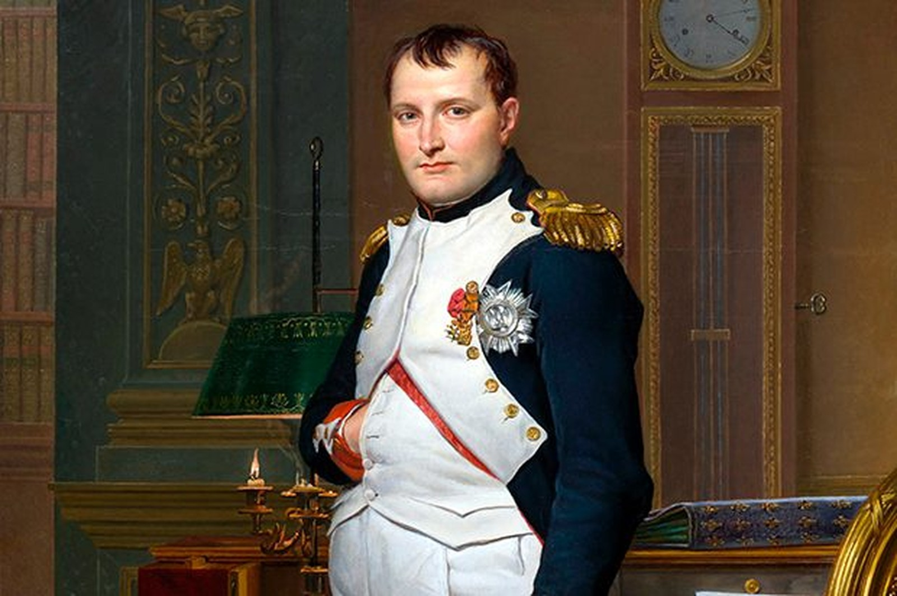

# American Esoterica

### The Eye of Providence &amp; The Hidden Hand

**What's actually hiding on the back of a dollar bill — and why the pyramid was left without a top.**

This is a long-form field guide connecting a symbol almost everyone has looked at and almost no one has been taught to read. Starting from the Eye of Providence and the unfinished pyramid on the Great Seal, it traces one argument across scripture, philosophy, history, and mathematics: that the oldest religious language about hidden powers and watching eyes is also the most precise description we have of how large institutions actually behave.

**The throughline, in short:** every system big enough to outgrow any single person's judgment develops something like a will of its own — scripture calls it a "power or principality," occultism calls it an *egregore*. That system survives by staying diffuse and unaccountable, an architecture Kierkegaard named "the Crowd" and modern bureaucracies perfected as plausible deniability. Its one vulnerability is total, unmediated visibility — the original meaning of the All-Seeing Eye, standing *coram Deo*, before an eye that cannot be lobbied, briefed, or managed.

**What's actually in it:**
- The Undying Worm (Mark 9:48) read as Gnostic Archons and psychological parasitism, illustrated with the Ouroboros
- Kierkegaard's Crowd, Hobbes's *Leviathan*, Gustave Le Bon's crowd psychology, Milgram and Zimbardo, and Erich Fromm's *Escape from Freedom* — tracing straight through to Edward Bernays and the modern press office
- Plausible deniability explained honestly — where it's a legitimate structural necessity (due process, operational security) and exactly where it curdles into institutional gaslighting, from the bystander effect up to full bureaucratic scale
- The Eye of Providence's real scriptural roots (Proverbs 15:3, Hebrews 4:13, Matthew 6:22–23, Job 34:21–22), the Eye of Horus and its six mathematical fractions, Bentham's Panopticon, and Simone Weil on attention as a trainable faculty
- **The missing capstone**: how an Egyptian pyramidion was engineered to look divine, how Pharaoh's vizier and priesthood actually managed him with incense and staged ritual, Akhenaten's failed attempt to remove them entirely — and why the Great Seal's pyramid was deliberately left without anyone standing on top of it
- Washington's refusal of a crown at Newburgh, set directly against Napoleon crowning himself at Notre-Dame — same hand-in-waistcoat pose, opposite choice — plus the key to the Bastille Lafayette mailed to Mount Vernon
- Thomas Jefferson's actual (smaller) role in the seal's design, and the razor he took to the Gospels
- Freemasonry's ten core teaching tools — the rough and perfect ashlar, Hiram Abiff, the checkered pavement, Boaz and Jachin, the winding staircase, the plumb and square and level, the sprig of acacia, Euclid's 47th Proposition, the Square and Compasses, and the Rosy Cross — each paired with the Bible verse it's built on
- A real Virginia field trip: Monticello, UVA's Rotunda and its deliberately unfinished Lawn, the Virginia State Capitol modeled on a Roman temple, and the George Washington Masonic Memorial built like the Lighthouse of Alexandria — plus honest myth-corrections on the Pentagon and L'Enfant's D.C. street plan
- Synchronicity, apophenia, and an honest account of both explanations for why patterns start appearing once you're looking for them
- Ontological shock, read through Plato's Cave, *The Matrix*, and *Alice in Wonderland*, and why "enlightenment" and "illumination" ended up as the same word doing two different jobs
- An original poem, *The King's Game*, opening the whole page and read line by line against everything that follows
- A full, categorized bibliography — real philosophers, real historians, real primary sources — for anyone who wants to go past the summary

None of it requires believing in a conspiracy. Read narrowly, it's a study in institutional psychology. Read esoterically, it's a map of two forces — an Eye and a Hand — that mystics, Gnostics, and occult philosophers have been symbolizing for centuries.

**[Read it here →](https://sauerninja.github.io/American-Esoterica/)**
